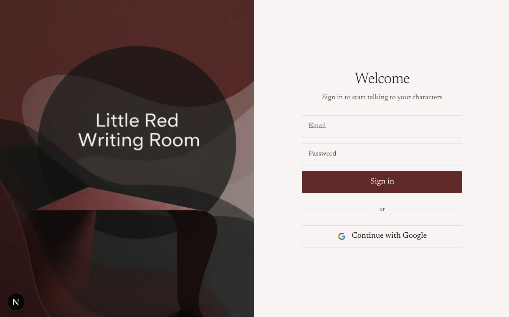
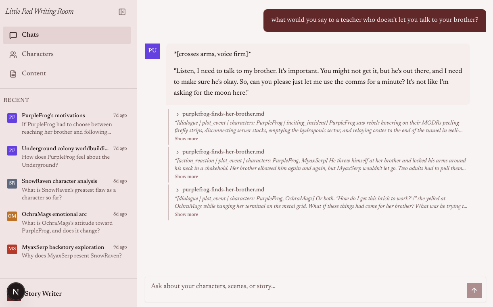

# little-red-writing-room

An agentic app to help writers develop characters and plots and worlds. Chat with your characters, ask questions about your story, and let the agent surface relevant passages from your uploaded documents — all grounded in your own writing.

|                                         |                                       |
| --------------------------------------- | ------------------------------------- |
|  |  |

> For a full product walkthrough see [docs/PRODUCT.md](docs/PRODUCT.md).

---

## Prerequisites

The app is composed of a Next.js frontend, a FastAPI backend, a Supabase Postgres database, a Qdrant vector store, and an OpenAI-powered agent pipeline. See [docs/ARCHITECTURE.md](docs/ARCHITECTURE.md) for a full technical overview.

- [Node.js](https://nodejs.org/) 18+ and [pnpm](https://pnpm.io/)
- [Python](https://www.python.org/) 3.11+
- [uv](https://docs.astral.sh/uv/) (Python package manager)
- [just](https://github.com/casey/just) (task runner)

Install `just` via Homebrew: `brew install just`

---

## 1. Clone and install dependencies

```bash
git clone https://github.com/your-org/little-red-writing-room.git
cd little-red-writing-room
just setup
```

This installs dependencies for the Next.js frontend (`web/`), the FastAPI backend (`srv/`), and the notebooks (`notebooks/`).

---

## 2. Configure environment variables

### Backend (`srv/.env`)

Copy the example file and fill in your keys:

```bash
cp srv/.env.example srv/.env
```

Open `srv/.env` and provide the following values:

| Variable                        | Where to find it                                                                               |
| ------------------------------- | ---------------------------------------------------------------------------------------------- |
| `DATABASE_URL`                  | Supabase Dashboard → Project Settings → Database → Connection string → URI (Direct connection) |
| `APP_SUPABASE_URL`              | Supabase Dashboard → Project Settings → API → Project URL                                      |
| `APP_SUPABASE_SERVICE_KEY`      | Supabase Dashboard → Project Settings → API → `service_role` (secret key)                      |
| `APP_OPENAI_API_KEY`            | [platform.openai.com/api-keys](https://platform.openai.com/api-keys)                           |
| `TOOL_RETRIEVAL_QDRANT_URL`     | Qdrant Cloud dashboard → your cluster URL                                                      |
| `TOOL_RETRIEVAL_QDRANT_API_KEY` | Qdrant Cloud dashboard → API key                                                               |
| `TOOL_RETRIEVAL_COHERE_API_KEY` | [dashboard.cohere.com](https://dashboard.cohere.com/)                                          |
| `TOOL_TAVILY_API_KEY`           | [app.tavily.com](https://app.tavily.com/)                                                      |

The remaining settings (`APP_LLM_MODEL`, `AGENT_*_MODEL`, collection names, etc.) have sensible defaults in `.env.example` and can be left as-is to get started.

### Frontend (`web/.env.local`)

The frontend connects to your Supabase project for authentication. Create `web/.env.local`:

```bash
NEXT_PUBLIC_SUPABASE_URL=https://your-project.supabase.co
NEXT_PUBLIC_SUPABASE_ANON_KEY=your-supabase-anon-key
```

Find the anon key in Supabase Dashboard → Project Settings → API → `anon` (public key).

---

## 3. Run database migrations

```bash
just migrate
```

This applies all SQL migrations in `srv/migrations/` to your Supabase Postgres database.

---

## 4. Start the development servers

In two separate terminals (or use `just dev` to run both concurrently):

```bash
# Terminal 1 — FastAPI backend (port 8008)
just dev-srv

# Terminal 2 — Next.js frontend (port 3003)
just dev-web
```

Open [http://localhost:3003](http://localhost:3003) in your browser.

---

## 5. Log in

Use the test account:

| Field    | Value           |
| -------- | --------------- |
| Email    | `test@lrwr.ink` |
| Password | `abc123`        |

---

## 6. Create characters

Go to **Characters** in the sidebar. Type a name into the input field and press **Add** (or hit Enter). Create one or more of the following from the _PurpleFrog_ story world:

| Name to enter | Who they are                                                                                                                               |
| ------------- | ------------------------------------------------------------------------------------------------------------------------------------------ |
| `PurpleFrog`  | 12-year-old protagonist (real name Mauve Cal). Quick, impulsive, fiercely loyal to her brother. Still adjusting to rebel life underground. |
| `SnowRaven`   | PurpleFrog's 16-year-old brother (Chion Cal). Methodical and mission-focused; feels responsible for the colony.                            |
| `OchraMags`   | Junior instructor of the rebel colony. No-nonsense engineer — all protocol, zero sentiment.                                                |
| `OzzieHeron`  | 13-year-old classmate. Practical and logical, quietly fond of PurpleFrog.                                                                  |
| `MyaxSerp`    | Older teen with a grudge against PurpleFrog and SnowRaven, blaming them for his father's death.                                            |

You can add all five at once; each gets a unique colour avatar automatically.

---

## 7. Upload and extract the sample documents

The `notebooks/sample_data/` directory contains two documents from the _PurpleFrog_ story world:

| File                              | Contents                                                                                                                                      |
| --------------------------------- | --------------------------------------------------------------------------------------------------------------------------------------------- |
| `purplefrog-finds-her-brother.md` | Full short story (5 scenes) — PurpleFrog escaping a Worm attack and reuniting with her brother SnowRaven in the ruins of underground New York |
| `purplefrog-story-notes.md`       | Scene-by-scene planning notes, world-building details (the rebel colony blueprint, the antagonists, writing guidelines)                       |

### Upload

1. Go to **Content** in the sidebar.
2. Click **Upload files** in the top-right corner.
3. Select both `.md` files from `notebooks/sample_data/`. The uploader accepts `.md`, `.docx`, and `.txt` files.

Each file appears in the list with an **Uploaded** badge once the transfer completes.

### Extract

Extraction chunks the file, classifies the chunks, embeds them, and stores them in the vector store so characters can retrieve them during chat.

1. Click the **Extract** button next to a file.
2. In the dialog that opens, select the characters to extract knowledge for — use **Select all** to tag every character at once.
3. Click **Run extraction**.

A live progress bar tracks the stages: _Splitting into chunks → Classifying chunks → Embedding & storing_. When done the badge updates to show how many chunks were stored (e.g. `42 chunks`).

Repeat for the second file. Extract both files before starting a chat.

---

## 8. Chat with a character

1. Open the **Chat** page from the sidebar.
2. Select a character from the picker.
3. Start a conversation — the agent responds using the extracted story content as its knowledge base and cites the source document inline.

---

## Available `just` commands

```
just setup          # install all dependencies
just dev            # run both servers concurrently
just dev-srv        # FastAPI backend only
just dev-web        # Next.js frontend only
just migrate        # apply database migrations
just test           # run all tests
just run-notebook   # launch Jupyter Lab
```
