This document covers the technical architecture & implementation decisions for Little Red Writing Room.

# Infrastructure Architecture

The system is split into five layers: frontend, backend, document processing, data stores, and observability.

**Frontend — Vercel (Next.js)**
The writer interacts with a Next.js chat interface deployed on Vercel. It handles document uploads (.md, .docx), displays streamed character responses with source citations, and manages the conversation UI. It communicates with the backend over REST and server-sent events (SSE) for streaming.

**Backend — Render (FastAPI + LangGraph)**
A FastAPI server deployed on Render hosts the LangGraph agent. The agent maintains multi-turn conversation state and routes between two tools: a **Character RAG tool** that retrieves grounding context from the writer's own documents via Qdrant, and a **Tavily search tool** that handles writing craft queries (e.g., Story Grid theory) that fall outside the local knowledge base. The agent calls GPT-4o for all LLM completions. Supabase Auth is checked on every request, and conversation threads are persisted to Supabase Postgres.

**Document Processing — Modal**
An agentic ingestion pipeline runs on Modal. When the writer uploads files through the UI, the pipeline normalizes formats (DOCX → plain text, Markdown parsed directly), chunks the content, extracts metadata (document type: character / scene / setting / worldbuilding), generates embeddings via OpenAI `text-embedding-3-small`, and upserts the vectors into Qdrant. Raw files are stored in Supabase Storage and document metadata is written to Supabase Postgres.

**Data Stores — Supabase + Qdrant Cloud**
Supabase serves three roles: **Auth** for user sessions, **Postgres** for relational data (conversations, threads, document metadata, user profiles), and **Storage** for raw uploaded files. Qdrant Cloud is the dedicated vector store, holding embedded chunks with metadata filters that allow retrieval scoped to a specific character, scene, or setting.

**Observability & Eval — LangSmith + RAGAS**
LangSmith receives traces from every agent run, providing visibility into retrieval chains, tool calls, and response generation. RAGAS evaluates retrieval quality using faithfulness, context precision, and context recall metrics against a synthetic golden dataset, with results fed into LangSmith for tracking over time.


# Agents & RAG Architecture

# Little Red Writing Room — System Architecture

This document covers the two core architectural sections of the system: the **Data Processing Pipeline** (document ingestion and knowledge extraction) and the **User Request Path** (SSE-based chat with avatar agents). These two sections are intentionally decoupled — the pipeline writes to the knowledge store, the request path reads from it, and they share no runtime dependencies beyond the store itself.

---

## Section 1: Data Processing Pipeline

### Shared Infrastructure

Both pipeline options share the same entry and exit points. FastAPI on Render receives the file upload, writes it to temporary storage, creates a Supabase job record with `status: pending`, and fires a Modal function. Modal updates the Supabase job record at each stage. The frontend subscribes to that record via Supabase Realtime and renders progress to the user.

All state persistence is handled by a **Document Processing Service** that wraps the pipeline. The pipeline itself produces outputs; the service decides what to write to Supabase and when. Neither the pipeline stages nor the Modal functions touch state directly.

```
FastAPI (Render)
  → create job record (Supabase)
  → fire Modal function
    → pipeline stages (Modal)
      → Document Processing Service
        → write to Qdrant (embeddings + payload)
        → write to Supabase (structured records)
        → update job status
  ← Supabase Realtime → frontend progress updates
```

---

### Option A: Naive Baseline Pipeline

**Purpose:** Establish RAGAS baseline scores. Fast ingestion, no LLM calls during processing, minimal metadata. Used for Task 5 evaluation.

**Pipeline graph:**

```
parse → recursive_split → embed → store
```

**Stage 1 — Parse**
Extract raw text from MD or DOCX using LangChain document loaders. Preserve filename and document structure for source metadata.

**Stage 2 — Recursive Split**
LangChain `RecursiveCharacterTextSplitter` with character hierarchy `["\n\n", "\n", ".", " "]`, chunk size 500 tokens, overlap 50 tokens. No semantic awareness — splits on natural text boundaries in priority order.

**Stage 3 — Embed**
Each chunk embedded via OpenAI `text-embedding-3-small`. Minimal Qdrant payload:

```python
{
  "text": "raw chunk text",
  "source_document": "filename",
  "chunk_index": 0
}
```

**Stage 4 — Store**
Chunks and embeddings written to Qdrant. Document Processing Service writes document record to Supabase and updates job status to `complete`.

**Retrieval at query time:**
Pure dense vector similarity. Top-k chunks passed through Cohere reranker and returned to the avatar agent. No metadata filtering, no structured profile injection, no gap detection.

---

### Option B: Agentic Metadata Extraction Pipeline

**Purpose:** Advanced retriever upgrade. Two LLM passes during ingestion produce taxonomy-tagged chunks and structured knowledge records that enable hybrid retrieval, gap detection, and automatic Tavily enrichment triggering. Used for Task 6 evaluation.

**Pipeline graph:**

```
parse → semantic_chunk → classify → extract_metadata → embed_with_payload → store
```

**Stage 1 — Parse**
Same as Option A.

**Stage 2 — Semantic Chunking with Overlap**
LangChain `SemanticChunker` splits on embedding similarity rather than character boundaries. Dialogue exchanges, action sequences, and worldbuilding descriptions each remain coherent as units. A configurable overlap window is preserved between adjacent chunks: a sliding set of sentences from the end of each chunk is prepended to the start of the next. This overlap creates continuity anchors so that scene transitions, pronoun chains, and cross-sentence character references are not severed at a chunk boundary. The result is that Stage 3's classification call has enough surrounding context to reliably tag `narrative_function`, `characters_present`, and `story_grid_tag` — particularly for chunks that fall mid-scene or mid-dialogue where isolated text would be ambiguous without the bridging context.

**Stage 3 — Classification Pass (per chunk)**
LLM call with Pydantic structured output against each chunk. The call receives two inputs: the chunk text (with its overlap prefix intact) and `known_characters` — the list of character names identified from the document during parsing or from previously extracted profiles. `known_characters` is injected into the system prompt rather than included in the output schema; it anchors name resolution so that ambiguous pronouns and aliases are mapped to canonical names before `characters_present` is populated, reducing cross-chunk inconsistency.

```python
# Call-time inputs (injected into system prompt, not output fields):
#   chunk_text: str          — the chunk content including overlap prefix
#   known_characters: list[str]  — canonical character names from the document

class ChunkClassification(BaseModel):
    content_type: Literal[
        "dialogue", "action_reaction",
        "description", "internal_monologue"
    ]
    narrative_function: Literal[
        "worldbuilding", "character_reveal",
        "plot_event", "backstory", "thematic"
    ]
    characters_present: list[str]    # resolved against known_characters
    story_grid_tag: Literal[
        "inciting_incident", "turning_point",
        "crisis", "climax", "resolution", "none"
    ]
    external_references: list[str]   # named characters/works not from the author
    implied_gaps: list[str]          # what this chunk implies but doesn't define
```

**Stage 4 — Document-level Extraction Pass**
Single LLM call across the full document (sliding window for long documents) producing structured records persisted to Supabase by the Document Processing Service:

```python
class EvidencedTrait(BaseModel):
    trait: str
    source_quote: str

class Relationship(BaseModel):
    target_character: str
    valence: Literal["ally", "antagonist", "neutral", "complex"]
    evidence: str

class CharacterProfile(BaseModel):
    name: str
    aliases: list[str]
    personality_traits: list[EvidencedTrait]
    stated_values: list[str]
    behavioral_patterns: list[str]
    relationships: list[Relationship]
    speech_patterns: str
    external_references: list[str]
    open_gaps: list[str]             # explicitly undefined attributes

class WorldElement(BaseModel):
    name: str
    element_type: Literal["setting", "technology", "faction", "artifact", "rule"]
    description: str
    connected_characters: list[str]

class NarrativeEvent(BaseModel):
    description: str
    characters_involved: list[str]
    emotional_weight: dict[str, str]  # character → emotional response
    story_grid_tag: str
```

**Stage 5 — Embed with Payload**
Each chunk embedded with full taxonomy metadata as Qdrant payload:

```python
{
  "text": "chunk text",
  "content_type": "dialogue",
  "narrative_function": "character_reveal",
  "characters_present": ["PurpleFrog", "OchraMags"],
  "story_grid_tag": "none",
  "external_references": [],
  "implied_gaps": ["PurpleFrog's life before Day 720 undefined"]
}
```

**Stage 6 — Store**
Chunks and embeddings written to Qdrant. Document Processing Service writes `CharacterProfile`, `WorldElement`, and `NarrativeEvent` records to Supabase and updates job status to `complete`.

**Retrieval at query time:**
Hybrid retrieval combining dense vector similarity with Qdrant metadata filtering on taxonomy tags. Character profiles fetched from Supabase and injected as primary structured context. Cohere reranker applied across the combined candidate set before final context assembly. See Section 2 for full retrieval node detail.

---

### Pipeline Comparison

|                            | Option A (Baseline)            | Option B (Advanced)                             |
| -------------------------- | ------------------------------ | ----------------------------------------------- |
| Chunking                   | RecursiveCharacterTextSplitter | SemanticChunker with chunk overlap              |
| LLM calls during ingestion | None                           | 2 passes (classify + extract)                   |
| Qdrant payload             | Minimal                        | Full taxonomy tags                              |
| Supabase records           | Job record only                | CharacterProfile, WorldElement, NarrativeEvent  |
| Retrieval                  | Dense vector + Cohere rerank   | Dense vector + taxonomy filters + Cohere rerank |
| Gap detection              | Not available                  | Native via `open_gaps` + `implied_gaps`         |
| Tavily trigger             | Supervisor heuristic only      | Supervisor + `external_references` field        |
| Context packet quality     | Ranked chunks only             | Ranked chunks + structured profile + gaps       |
| Rubric mapping             | Task 5 baseline                | Task 6 upgrade                                  |

---

---

## Section 2: User Request Path (SSE)

### Architectural Principle

No agent manages its own state. Every node in the LangGraph graph is a pure function — it receives inputs, produces outputs, and returns. All persistence is handled by the **AvatarSessionService**, which wraps the graph at the endpoint level. The service reads conversation history and narrative state from Supabase before invoking the graph, receives the graph's output bundle, persists what needs persisting, and opens the SSE stream back to the frontend.

The LangGraph graph itself is stateless. It receives a fully assembled input bundle and returns a fully assembled output bundle. The service owns everything before and after.

---

### Request Flow

```
user message
  → FastAPI SSE endpoint (Render)
    → AvatarSessionService
        reads: conversation history (Supabase)
        reads: narrative state (Supabase)
        reads: character registry (Supabase)
      → LangGraph graph (stateless)
          → supervisor node
          → retrieval node
          → [conditional] tavily enrichment node
          → [conditional] gap detection node
          → avatar agent node  ← streams tokens via SSE
          → output assembly node
      ← output bundle
    → AvatarSessionService
        writes: updated conversation history (Supabase)
        writes: updated narrative state (Supabase)
  ← SSE stream to frontend
```

---

### Agent Graph

```mermaid
flowchart TD
    START([User Message]) --> SERVICE

    subgraph SERVICE["AvatarSessionService (Render / FastAPI)"]
        READ["Read from Supabase\nconversation history · narrative state · character registry"]
        WRITE["Write to Supabase\nupdated history · narrative state"]
    end

    READ --> SUPERVISOR

    subgraph GRAPH["LangGraph Graph (stateless)"]
        direction TB

        SUPERVISOR["🎯 Supervisor Agent\nClassify intent · resolve characters\nOrchestrate tool calls and agents\nReturn final response + metadata"]

        RETRIEVAL["🔍 Retrieval Tool\nQdrant vector search\n+ taxonomy filters (Option B)\nCohere rerank"]

        TAVILY["🌐 Tavily Tool\nWeb search for external\ncharacter / work references"]

        GAP["⚠️ Gap Detection Agent\nStructure undefined attributes\nas development signals"]

        AVATAR["🎭 Avatar Agent\nAnalytical or in-character\nresponse · streams via SSE"]

        SUPERVISOR -->|"calls tool"| RETRIEVAL
        SUPERVISOR -->|"calls tool (conditional)"| TAVILY
        SUPERVISOR -->|"delegates"| GAP
        SUPERVISOR -->|"delegates"| AVATAR

        RETRIEVAL -->|"tool result"| SUPERVISOR
        TAVILY -->|"tool result"| SUPERVISOR
        GAP -->|"agent response"| SUPERVISOR
        AVATAR -->|"agent response + metadata"| SUPERVISOR
    end

    subgraph STORES["External Stores"]
        QDRANT[(Qdrant Cloud\nvector store)]
        SUPABASE[(Supabase\njob state · profiles · history)]
        COHERE([Cohere Rerank API])
        TAVILYAPI([Tavily Search API])
    end

    RETRIEVAL <-->|dense search + filters| QDRANT
    RETRIEVAL <-->|rerank candidates| COHERE
    TAVILY <-->|web search| TAVILYAPI
    SUPERVISOR -->|"final output bundle"| WRITE
    SUPERVISOR -->|SSE token stream| END_NODE([User])

    style TAVILY stroke-dasharray: 5 5
    style GAP stroke-dasharray: 5 5
    style SERVICE fill:#f0f4ff,stroke:#6b7280
    style GRAPH fill:#fdf4ff,stroke:#6b7280
    style STORES fill:#f0fdf4,stroke:#6b7280
```



> The supervisor is the single orchestration point. Retrieval and Tavily are LangChain tools the supervisor calls directly. Gap Detection and Avatar are sub-agents the supervisor delegates to. All state flows back to the supervisor, which returns a final output bundle — response text plus metadata — to the `AvatarSessionService` for persistence. Dashed borders indicate conditional invocations.

---

### Agent and Tool Roles

#### Supervisor Agent

The central orchestrator. Receives the fully assembled input bundle from the `AvatarSessionService` — user message, conversation history, narrative state, and character registry — and coordinates all downstream calls step by step.

Responsibilities:

- Classify intent: `analytical | in_character | gap_probe | external_reference | scenario`
- Resolve which characters are relevant to the query
- Call the Retrieval tool with appropriate filters
- Conditionally call the Tavily tool if external references are detected
- Delegate to the Gap Detection agent if retrieval confidence is low
- Delegate to the Avatar agent with the fully assembled context
- Return final output bundle to the service

```python
class SupervisorOutput(BaseModel):
    response_text: str
    intent: str
    resolved_characters: list[str]
    citations: list[str]
    gap_flags: list[GapResponse]
    narrative_state_delta: dict        # any state updates implied by this turn
    tavily_used: bool
```

The `AvatarSessionService` receives this bundle and decides what to persist. The supervisor does not write to any store.

---

#### Retrieval Tool _(LangChain tool)_

Called directly by the supervisor as a standard LangChain tool. Executes the full retrieval pipeline and returns a ranked context packet to the supervisor.

**Step 1 — Qdrant query**
Dense vector search against the query embedding. Option A: no filters. Option B: metadata filters derived from the supervisor's resolved characters and intent — for example `characters_present: PurpleFrog` combined with `content_type: dialogue | action_reaction` for an in-character query.

**Step 2 — Cohere Reranking**
Candidate chunks passed to Cohere Rerank API (`rerank-english-v3.0`) with the original user query as the reranking signal. Top-k after reranking returned to the supervisor.

Cohere reranking runs in both pipeline options. The benefit is larger with Option B because taxonomy-filtered candidates are already more relevant before reranking, giving Cohere better material to work with.

**Tool return value:**

```python
class RetrievalResult(BaseModel):
    character_profiles: list[CharacterProfile]  # Option B only, pre-fetched by service
    ranked_chunks: list[RankedChunk]
    low_confidence: bool                         # triggers gap detection if True
```

---

#### Tavily Tool _(LangChain tool, conditional)_

Called by the supervisor when it detects a reference to a named character or work not originating in the author's uploaded material — either from the query itself or, in Option B, from the `external_references` field populated at ingestion.

Executes web searches via LangChain's Tavily integration and returns summarized external context to the supervisor. The supervisor is prompted to treat this context as supplementary and subordinate to the author's own writing — if the author's notes contradict the external source, the author's version wins.

---

#### Gap Detection Agent _(conditional)_

Delegated to by the supervisor when the Retrieval tool returns `low_confidence: True`, or when `implied_gaps` in retrieved chunk payloads are relevant to the query (Option B only).

Receives the partial retrieval result and the query. Produces structured gap responses rather than allowing the Avatar agent to hallucinate into undefined territory:

```python
class GapResponse(BaseModel):
    undefined_attribute: str
    what_is_implied: str
    development_suggestion: str
```

Returns gap responses to the supervisor, which includes them in the context passed to the Avatar agent and in the final output bundle.

---

#### Avatar Agent

Delegated to by the supervisor once the full context is assembled — ranked chunks, optional character profiles, optional Tavily results, and optional gap flags. Generates the response in one of two modes:

- **Analytical mode** — synthesizes across character profiles and retrieved chunks, responds as a story analyst, cites source material back to the author's own text
- **In-character mode** — responds as the character or about the character's likely behavior, grounded strictly in retrieved evidence

Streams tokens via SSE callback. Returns response text and any metadata the supervisor needs to populate its output bundle. Does not persist anything.

---

### Orchestration Flow

```
AvatarSessionService
  → assemble input bundle (read Supabase)
  → invoke supervisor

supervisor
  → call retrieval_tool(query, filters)
  → [conditional] call tavily_tool(queries)
  → [conditional] delegate to gap_detection_agent
  → delegate to avatar_agent(assembled context)
  → return SupervisorOutput

AvatarSessionService
  → receive SupervisorOutput
  → persist narrative_state_delta + conversation history (Supabase)
  → stream response_text to frontend via SSE
```

---

### Option A vs Option B at Query Time

|                                  | Option A                  | Option B                                  |
| -------------------------------- | ------------------------- | ----------------------------------------- |
| Structured profile injection     | None                      | CharacterProfile from Supabase            |
| Retrieval tool — Qdrant query    | Dense vector only         | Dense vector + taxonomy filters           |
| Retrieval tool — Cohere rerank   | Applied to raw candidates | Applied to pre-filtered candidates        |
| Gap detection agent              | Not available             | Native via `open_gaps` + `implied_gaps`   |
| Tavily tool trigger              | Supervisor heuristic only | Supervisor + `external_references` field  |
| Context quality passed to Avatar | Ranked chunks only        | Ranked chunks + structured profile + gaps |

---

### RAGAS Evaluation Notes

The same test question set runs against both pipeline options. Cohere reranking is present in both, so its contribution is held constant — the delta in RAGAS scores between Option A and Option B isolates the value of semantic chunking, taxonomy classification, and structured profile injection specifically.

Key metrics to watch:

- **Context precision** — Option B's taxonomy filtering should improve this significantly by reducing irrelevant chunks before Cohere sees them
- **Context recall** — semantic chunking keeps related content coherent rather than split across chunk boundaries; chunk overlap ensures that cross-boundary evidence is preserved in adjacent chunks, reducing the chance of a relevant sentence being inaccessible at retrieval time
- **Faithfulness** — structured profile injection gives the avatar agent authoritative grounding, reducing hallucination into undefined character attributes

Both options are implemented behind a feature flag — same pipeline entry point, different processing path selected by a config setting — so RAGAS evaluation is a clean A/B comparison against identical test questions.
